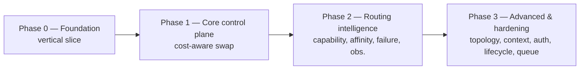

# Linguine — Development Plan

High-level phased plan for building the linguine local lab inference control plane. This document sits above `vision.md`: it sequences the work, calls out dependencies, and marks what is deferred. The technical detail for each feature lives in `vision.md` (§1–§8); this plan says *when* and *in what order* to build them.

## Scope & Principles

- **Single self-contained Go binary** (`modernc.org/sqlite`, CGO-free). No external runtime dependencies. Honour this in every phase — if a feature needs a broker, a separate process, or a Kubernetes sidecar, it is out of scope for this plan.
- **Cost-aware scheduling is the core novelty** (see `vision.md` §3, reviewer's "genuinely novel" note). Phasing protects that core: the vertical slice and core control plane land before any intelligence or hardening layers.
- **No backwards-compatibility shims.** Each phase's API is the current API. If a shape changes, callers update. `model` (exact) and `requirements` (capability) are both first-class in §5; neither is a compat path.
- **Tests stay current with routes.** Every phase adds integration tests for the new ingress/router behaviour before the phase is declared done.
- **design/schema.dbml must stay in sync** with the SQLite schema introduced in Phase 0 and evolved in every later phase that touches storage.

## Phase Summary

| Phase | Theme | Milestone |
|---|---|---|
| 0 | Foundation & vertical slice | One streaming completion, end-to-end, single node |
| 1 | Core control plane | Multi-node fleet with dynamic hot/cold swap + dashboard |
| 2 | Routing intelligence (review Stage 1) | Sticky sessions, clean failure, live metrics |
| 3 | Advanced & hardening (review Stage 2) | Multi-tenant, topology-aware, self-tuning residency |

---

## Phase 0 — Foundation & Vertical Slice

Establish the skeleton and prove the SSE-over-NNG path works end-to-end on a single node before any routing logic exists.

**Deliverables**
- Go module + single-binary layout (router, worker daemon, shared types).
- SQLite schema: `tokens`, `nodes`, `swap_logs`, `sessions`, `kv_cache_stats`, `capability_profiles`. Update `design/schema.dbml` alongside.
- NNG (mangos) REQ/REP framing prototype: chunk framing, header handshake, EOF control frame (per `vision.md` §2).
- Minimal worker daemon wrapping `llama-server` lifecycle (start/stop/health only — no swap yet).
- OpenAI-compatible ingress `/v1/chat/completions` with `stream=true` proxied through to one worker.

**Validation**
- Integration test: client streams a completion through router → worker → `llama-server` and receives well-formed SSE chunks terminated by `data: [DONE]`.
- Unit tests for NNG frame encode/decode and SQLite migrations.

**Exit criteria**
- One model, one node, streaming works, schema is in place. No routing, no swap, no dashboard.

---

## Phase 1 — Core Control Plane

Turn the skeleton into the product's central thesis: cost-aware hot/cold model swapping across a fleet.

**Deliverables**
- Heuristic router implementing the §3 score formula: `WaitTime + SwapPenalty + VRAMPenalty - CacheAffinity` (CacheAffinity wired but only meaningful once Phase 2 session affinity exists; defaults to 0 here).
- Model swap lifecycle on the worker (`vision.md` §4): `swap_and_run`, graceful drain, local engine reload, ack & execute.
- Node heartbeat ingestion (the §3 state payload, including `active_conversations` / `cached_tokens` / `pinned_sessions` fields, populated as zeros for now).
- HTMX admin dashboard (ColaFanta Fiber v3 + Templ): node inventory, active models, swap log, live VRAM.

**Validation**
- Integration test: two nodes, different hot models, request for a cold model triggers a swap on the cheaper node and streams correctly.
- Dashboard renders live heartbeats and swap history.

**Exit criteria**
- Multi-node fleet, dynamic swap, cost-aware routing, live dashboard. The system is "a good router" in the reviewer's words.

---

## Phase 2 — Routing Intelligence (review Stage 1)

The five gaps the reviewer flagged as turning this from a good router into a serious distributed inference platform.

**Deliverables**
- **Capability-based routing** (`vision.md` §5): profile registry, `requirements` → candidate model set, union balancing across candidates via the §3 scorer. `model` stays first-class.
- **Session affinity & KV-cache awareness** (`vision.md` §6): `session_id` affinity table in SQLite, idle-timeout expiry, cache-aware re-routing, affinity-breaks-under-load trade-off. Activates the `CacheAffinity` term from §3.
- **Failure & recovery** (`vision.md` §7): abort / node-lost NNG control frames, router-restart recovery from SQLite WAL, worker watchdog with clean SSE termination, `router_epoch` schema stub for future multi-router.
- **Observability** (`vision.md` §8): Prometheus `/metrics` endpoint, OpenTelemetry traces keyed by `session_id` / `node_id`.

**Validation**
- Integration tests: a second conversation turn pins to the same node; killing a worker mid-stream yields a clean `node_lost` error event and `[DONE]`; restarting the router recovers affinity state.
- Metrics scrape + a trace waterfall visible in local Grafana / Jaeger.

**Exit criteria**
- Sticky sessions, cache-aware re-routing, graceful failure, day-one observability.

---

## Phase 3 — Advanced & Hardening (review Stage 2)

The remaining five review items. These are genuinely optional for a first useful release and are sequenced last deliberately — each adds real complexity and is easier to design once Phases 1–2 have generated real traffic data.

**Deliverables (in suggested sub-order)**
- **Context-aware scheduling:** fold `estimated_prompt_processing + estimated_generation_time` into the score so a 400k-context request doesn't naively lose to a cheap swap.
- **Multi-GPU topology awareness:** extend heartbeat with `gpu_count`, `interconnect`, `numa_group`; scheduler prefers topology-appropriate nodes for MoE / large-context models.
- **Model lifecycle policies:** LRU/LFU eviction for VRAM, prewarming, predictive residency from 24h demand — treat VRAM as an OS-style cache.
- **Authentication & quota model:** users, organisations, API keys, per-org token quotas in SQLite.
- **Dispatch queue evaluation:** assess whether a router→dispatch-queue / workers-consume-when-ready model beats strict REQ/REP once long streams coexist with newly-free workers. Decision point, not a guaranteed rewrite.

**Validation**
- Per-item integration tests; load test comparing Phase 2 vs Phase 3 scheduler decisions on a mixed context-length workload.

**Exit criteria**
- Multi-tenant, topology-aware, self-tuning residency. The system is "a serious distributed inference platform."

---

## Deferred / Out of Scope (for this plan)

- **Multi-router HA / leader election:** schema stubbed in Phase 2 (`router_epoch`); active work deferred until a real HA requirement appears.
- **SSO (OKTA) integration:** not part of the inference control plane; belongs to a separate auth surface and is not sequenced here.
- **LMS / bidirectional integrations, archiving:** unrelated product surface; out of scope for this plan.
- **Non-`llama-server` engine adapters beyond `vLLM`:** `vLLM` adapter is Phase 3-adjacent; other engines added on demand.

## Open Questions

- **Session ID provenance:** derive from client `chat_id`, or hash `(api_key + conversation prefix)`? Affects Phase 2 affinity table design and the auth model in Phase 3.
- **CacheAffinity replay-cost model:** how does the worker estimate `T_replay(cached_tokens)` cheaply enough to put in a heartbeat? May need a per-model lookup table rather than a live measurement.
- **Capability profile authoring:** hand-edited SQLite rows, a dashboard UI, or both? Decide before Phase 2 starts.
- **Dispatch-queue rewrite threshold:** what observed stream-concurrency symptom would actually trigger the Phase 3 REQ/REP → dispatch-queue change?
